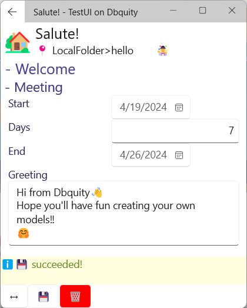

# AI about the HelloWorld model source

Here is what Microsoft's Copilot had to say about the HelloWorld `site model` on a rainy spring day in April 2024:

<i>
The Dbquity Modeling Language is an interesting tool! Let’s break down the information from the selected text:

1. Site Description:
    - The site is named “HelloWorld” and is located at model.dbquity.com/examples.
    - It’s version 1.0.0.
    - The site illustrates various concepts such as classes, invariants, areas, and multiline text.
2. Class: Period:
    - The Period class represents an interval of a certain number of days.
    - It has three fields:
        - Start: A date field that initializes to today’s date by default.
        - Days: An integer field representing the number of days in the interval.
        - End: Another date field.
    - The class uses an invariant property:
        - Start + Days = End (the interval is consistent).
        - Start <= End (the start date is before or equal to the end date).
3. Area: Welcome:
    - Contains a Period instance named Meeting.
    - Also includes a multiline text field called Greeting with a placeholder for kind words (emoji allowed).

Overall, Dbquity seems to be a powerful modeling language for capturing and managing data structures.
</i>

# Inventor's comments

As the inventor of Dbquity, I enjoyed reading that break-down and I hope that repeating it here conveys that the idea of the Dbquity language is to be both concise and intuitive.

## indentation defines model composition and is reflected in the UI 
It is also apparant that indentation is key in capturing the *structure* of a Dbquity `site`.

This particular `site` has a simple structure consisting of the a single `area` **Welcome** with two fields `Period` **Meeting** and `text` **Greeting** as you see in this screenshot:



## the model is it!
Another fact to know about Dbquity is that a site model is the only source artefact needed to deploy and run a site on your favourite cloud storage and invite others to share the data stored on that site.

To deploy HelloWorld.dbquity to a site called hello on  your local harddisk use this [CLI](https://model.dbquity.com/#command-line-interface-cli) command:

```bat
dbquity deploy hello -caption:"Salute!" HelloWorld.dbquity
```
> If, now, you look in your
> ```
> %LOCALAPPDATA%\Dbquity\
> ```
> folder, you'll find a subfolder called `hello.test` where `.test` signifies that the site is meant for testing locally thru the Dbquity UI before publishing the model for others to deploy to "real" sites.

Once that is done, run the [TestUI](https://model.dbquity.com/#test-ui) and [Go] to the hello test site.

## declarative vs imperative
Next, try to interact with the Start, Days and End fields of the Meeting and notice how changing one updates another thanks to the `invariant` property declared on the Period `class`. No need to author three separate pieces of code, one for each field, and keep them consistent.

Thus, this invariant is meant to illustrate a maintainability point about being as declarative as possible.

Cheers  
*Lars*