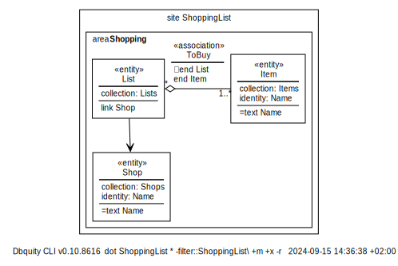

# What's in a shopping list?

For the purpose of illustrating key Dbquity concepts, in this example we want to work with lists of items to buy such as milk, potatoes, and bread. And we want to note in which shop we go to get the items on a particular list.

In Dbquity terms, we want a collection of Lists where each List is associated to one or more Item entities, and each list should be able to link to a shop. This can be declared as follows:

<table><tr><td><pre><code>
:(ShoppingList.dbquity)
</code></pre></td>
<td></td></tr></table>

## `entity` models: Item, List, and Shop
Notice that 
1. all three `entity` types declare a `collection`,
2. the Item `entity` type and the Shop `entity` type both declare a `text` Name field which forms their `identity`, and
3. the List `entity` declares no fields and no `identity`.

We can use this model to illustrate the core semantics of an entity:
> *an `entity` is a structured piece of data, which we can save into its `collection` and then later find again by its `identity`*.

In order for the *find again* piece to work, the `identity` is unique within the `collection`:

- As mentioned, we can have Item entities with distinct names such as "milk", "potatoes", and "bread", but, we cannot have two different Item entities named "bread", because then the collection would not know which "bread" to return when we asked it for the "bread" Item.

- It is however, very possible to have a Shop and an Item both identified as "bread", because Shops and Items are two distinct collections.

The entities declared by the `entity` model List will be assigned increasing (but not necessarily consequtive) integer numbers as their `identity`, because the model does not declare otherwise. 

## `association` model: ToBuy
Declaring the `association` ToBuy enables users to associate Item entities with List entities such that for a List to be considered valid, at least one Item should be associated To Buy as captured by `multiplicity: 1..*` under `end Item`. The other `end` of the association links to List and as depicted in the diagram defaults to a `multiplicity` of `0..*` (or just `*`)

## `link` a List to a Shop
Finally, the ability to link a List to a specific Shop is captured by the line `link Shop`, which does not declare any constraints, meaning that any List entity may be linked to a single Shop.