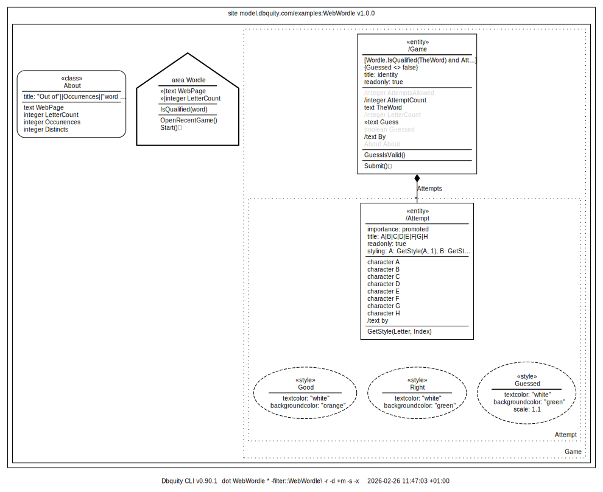
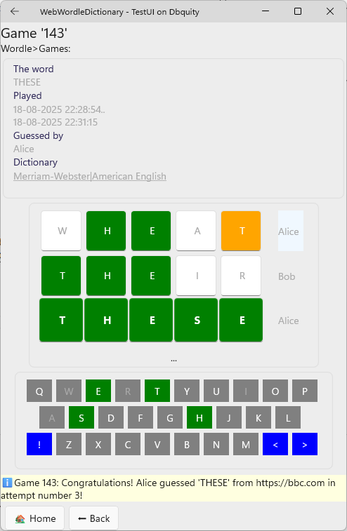
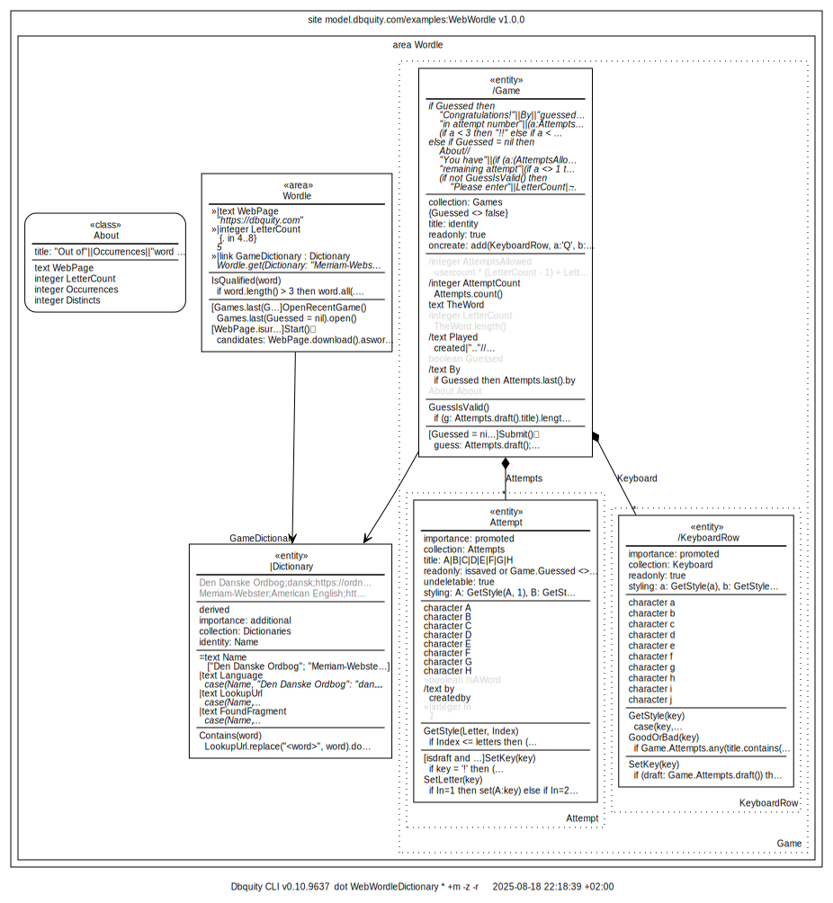

# Guess a word off a web page

This model introduces the `style` model element and the `input` field modifier. It utilizes the built-in `download()` function, which when called on a text that contains a url downloads the content as a text.

Here are a few screen shots:

||||
|-|-|-|

and here is the model diagram:



## Exercise: add a keyboard to WebWordle...

The [WebWordle.dbquity](WebWordle.dbquity) file contains the model source, and the sketch of adding a keyboard to the `Game`, which is shown below, showcases both the `case`function and `oncreate`, which is one out of 4 `entity` triggers:

```dbquity
oncreate, onrefresh, ondelete, oncopy
```

As an exercise, you are encouraged to complete the sketch for a fully functional keyboard to replace the input field `Guess`!

```dbquity
entity Game
    ...
    entity Attempt
        ...
        integer In
            input
            hidden
        action SetKey
            parameter key
            execution:
                if key='☑️' then Game.Submit()  # Submit needs to only create a new attempt, if we are not done
                else if key = '🔙' then (SetLetter(nil); if In>1 then set(In: In - 1))
                else (SetLetter(key); set(In: if In = 8 then 1 else In + 1))
        action SetLetter
            parameter key
            execution:
                if In=1 then set(A:key) else if In=2 then set(B:key) else if In=3 then set(C:key)
                else if In=4 then set(D:key) else if In=5 then set(E:key) else if In=6 then set(F:key)
                else if In=7 then set(G:key) else if In=8 then set(H:key)
    oncreate:
        add(Attempt, In:1); # blank attempt for keying-in
                            # - btw, do not style the last Attempt, unless we are done!
        add(KeyboardRow, a:'q', b:'w', c:'e', d:'r', ...);
        add(KeyboardRow, a:'a', b:'s', ...);
        add(KeyboardRow, a:'☑️', b:'z', ..., i:'🔙')
    entity KeyboardRow
        collection: Keyboard
        readonly
        character a
        character b
        character c
        ...
        character j
        action SetKey
            parameter key
            execution:  Game.attempts.last().SetKey(key)
        styling:        a: GetStyle(a), b: GetStyle(b), c:GetStyle(c), ...
        function GetStyle
            parameter key
            expression:
                case(key,
                    'a','s','d','f','g','h','j','k','l': MiddleRow,
                    '☑️','🔙': Action,
                    default: NormalKey)
        style NormalKey
            onclick:    SetKey(.)
            setters:    textcolor: white,
                        backgroundcolor: gray
        style MiddleRow
            onclick:    SetKey(.)
            setters:    textcolor: white,
                        backgroundcolor: gray,
                        xtranslation: 18 
        style Action
            onclick:    SetKey(.)
            setters:    textcolor: white,
                        backgroundcolor: oceanblue,
                        
```

## A more elaborate example including web-based dictionary lookup

As an example of a more elaborate featureset including keyboard and using a web-based dictionary to validate words you could see screen shots like

|||
|-|-|

The 300+ lines of model source is here: [WebWordleDictionary.dbquity](WebWordleDictionary.dbquity).



