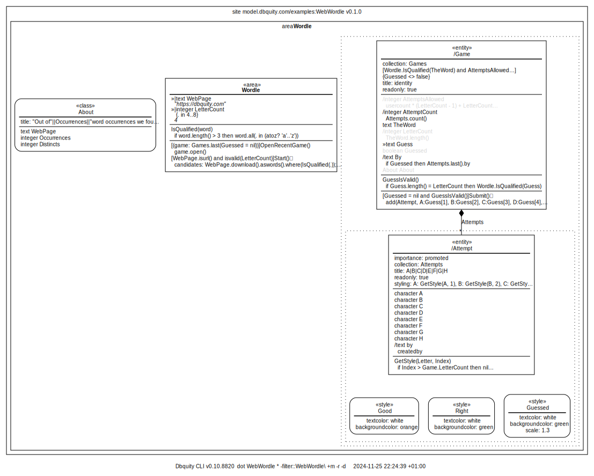

# Guess a word off a web page

This model introduces the `style` model element and the `input` field modifier. It utilizes the built-in function `download()` function, which when called on a text that contains a url downloads the content of that webpage as a text.

Here is the overview:



The [WebWordle.dbquity](WebWordle.dbquity) file contains the model, and the sketch of adding a keyboard to the `Game`, which is shown below, showcases both the `case`function and `oncreate`, which is one out of 4 `entity` triggers:

```dbquity
oncreate, onrefresh, ondelete, oncopy
```

As an exercise, you are encouraged to complete the sketch for a fully functional keyboard to replace the input field `Guess`!

```dbquity
entity Game
    ...
    entity Attempt
        ...
        integer In
            input
            hidden
        action SetKey
            parameter key
            execution:
                if key='☑️' then Game.Submit() // the current Submit action needs to create a new attempt
                else if key = '🔙' then (SetLetter(nil); if In>1 then set(In: In - 1))
                else SetLetter(key)
        action SetLetter
            parameter key
                if In=1 then set(A:key) else if In=2 then set(B:key) else if In=3 then set(C:key)
                else if In=4 then set(D:key) else if In=5 then set(E:key) else if In=6 then set(F:key)
                else if In=7 then set(G:key) else if In=8 then set(H:key)
    oncreate:
        add(Attempt); // blank attempt for keying-in
        add(KeyboardRow, a:'q', b:'w', c:'e', d:'r', ...);
        add(KeyboardRow, a:'a', b:'s', ...);
        add(KeyboardRow, a:'☑️', b:'z', ..., i:'🔙')
    entity KeyboardRow
        collection: Keyboard
        readonly
        character a
            ontap:      SetKey(a)
        character b
            ontap:      SetKey(b)
        character c
            ontap:      SetKey(c)
        ...
        character j
            ontap:      SetKey(j)
        action SetKey
            parameter key
            execution:  Game.attempts.last().SetKey(key)
        styling:        a: GetStyle(a), b: GetStyle(b), c:GetStyle(c), ...
        function GetStyle
            parameter key
            expression:
                case(key,
                    'a','s','d','f','g','h','j','k','l': MiddleRow,
                    '☑️','🔙': Action,
                    default: NormalKey)
        style NormalKey
            setters:    textcolor: white,
                        backgroundcolor: gray
        style MiddleRow
            setters:    textcolor: white,
                        backgroundcolor: gray,
                        xtranslation: 18 
        style Action
            setters:    textcolor: white,
                        backgroundcolor: oceanblue,
                        
```

