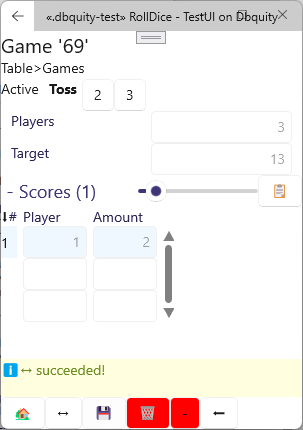

# Roll a Dice 🎲 behaving

In trying to push the notion of declarativeness as far as possible whilst realizing that imperative action cannot be completely avoided, Dbquity introduces the notion of entity `behaviour` as a single, declarative expression that orchestrates a number of imperative `step` members declared on the entity.

It remains unknown whether this notion of `behaviour` will be truly useful or not, but the only way of finding out is to put it out there, so that is the purpose of the present roll-a-dice example.


The model introduces a Table whose behaviour is to keep offering the creation of a new game.
A Game keeps the Scores of a number of players as they take turns tossing:

```dbquity
while not IsDone() do
    with player in 1..Players || Toss(player)
```

where Players is the number of players in this Game as determined when the Game was created, and `IsDone()` calls the parameter-less `function` IsDone which is declared on `entity` Game.

So long as the game is not done, we play a round, in which all players from number 1 up to Players get to Toss in parallel; meaning in no particular order, but only once per player within this round.

Toss is a `step` in the Game `behaviour` and the `||` operator means that the tosses can occur in parallel as mentioned (we also have `;`: sequence, and `|`: choice operators for declaring `behaviour`).

## Test it out :-)

The model source is here: [RollDice.dbquity](RollDice.dbquity) and as always, you can deploy it locally

```bat
dbquity deploy RollDice *
```

and try playing it using the [`TestUI`](https://model.dbquity.com/#test-ui).

Alternatively, consider this [automated test](RollDice.dbquity-test) of the model:

```dbquity
test RollDice
    deployment:     model.dbquity.com/examples/behaviour:RollDice
    on:             Table                       # scoping first to the Table area
    act:            set(Players: 1);            # test boundaries using assertfailure
                    assertfailure NewGame();
                    set(Target: 6);
                    assertfailure NewGame()   
    act:            # at this point, the changes (Players=1, Target=6) to Table are committed
                    set(Players: 3, Target: 13); # set up for a quick game, and
                    NewGame()                   # create it - and autocommit
    on:             Games.last()                # now scope expressions to the newly create game
    invariant:      # from now on, the invariant is asserted at the end of every act, test, dataset
        Scores.count() in 0..Players and Scores.all(Amount in 1..Game.Target + 5)
    act:            # nothing to commit at this point
                    Toss(1);                    # includes an autocommit
                    assertfailure Toss(1)       # only one toss per player in each round
    assert:
        state = "Active";
        get(Score:1).Amount > 0;
        Scores.count() = 1
    act:            Toss(3);
                    assertfailure Toss(1);
                    assertfailure Toss(3);
                    Toss(2);                    # last toss in first round
    assert:
        state = "Active";
        Scores.count() = 3;
        Scores.all(Amount in 1..6)
    act:            Toss(2);                    # first toss in second round
                    assertfailure Toss(2);
                    Toss(3);
                    assertfailure Toss(3);
                    assertfailure Toss(2);
                    Toss(1);                    # last toss in second round
    assert:
        state = "Active";
        Scores.count() = 3;
        Scores.all(Amount in 2..12)
    act:            foreach p in 1..Players do  # foreach over players for third round
                        Toss(p)
    assert:
        state = "Active" or state = "Completed";
        Scores.count() = 3;
        Scores.all(Amount in 3..18)
    action PlayRound                            # a test may declare an action
        execution:  foreach i in 1..Players do Toss(i)
    act:            while not IsDone() do       # act may invoke entity functions
                        PlayRound()             # and test actions
    assert:
        state = "Completed";
        IsDone();
        Scores.count() = Players;
```

You may run this test thus:

```bat
dbquity test RollDice , RollDice
```

to see in the prompt each commit of the test execution:

```bat
C:\Code\DbquityExamples\behaviour>dbquity test RollDice , RollDice   
Dbquity CLI v0.10.8199
    test RollDice , RollDice
Parsing RollDice.dbquity:
    site RollDice..............
validating
    site RollDice...........................ok

Creating test site: LocalFolder>RollDice-20240427T102206...
    site RollDice (model.dbquity.com/examples/behaviour:RollDice v0.10.0)
Running RollDice.dbquity-test
TEST RollDice:
line 8: Start-of-act - committed these changes:
    Update:
    Table 1|6
line 10: 'NewGame()' - autocommit - committed these changes:
    Add:
      Game '69' 3|13
    Update:
    Table 3|13*
line 16: 'Toss(1)' - autocommit - committed these changes:
    Add:
        Score '1' 4
    Update:
      Game '69' 3|13*
line 24: 'Toss(3)' - autocommit - committed these changes:
    Add:
        Score '3' 4
    Update:
      Game '69' 3|13*
line 24: 'Toss(2)' - autocommit - committed these changes:
    Add:
        Score '2' 3
    Update:
      Game '69' 3|13*
line 34: 'Toss(2)' - autocommit - committed these changes:
    Update:
        Score '2' 9
      Game '69' 3|13*
line 34: 'Toss(3)' - autocommit - committed these changes:
    Update:
        Score '3' 7
      Game '69' 3|13*
line 34: 'Toss(1)' - autocommit - committed these changes:
    Update:
        Score '1' 10
      Game '69' 3|13*
line 40: 'foreach p in 1..Players do Toss(p)' - autocommit - committed these changes:
    Update:
        Score '1' 11
        Score '2' 10
        Score '3' 9
      Game '69' 3|13*
line 48: 'while not IsDone() do PlayRound()' - autocommit - committed these changes:
    Update:
        Score '1' 17
        Score '2' 17
        Score '3' 13
      Game '69' 3|13*

PASSING
deleting test site LocalFolder>RollDice-20240427T102206
ok

C:\Code\DbquityExamples\behaviour>▮
```

> Notice that the line numbers indicate the last line of the `act` in which the commit occurs (which sometimes is not the specific line from where the commit is invoked).

You may also add the `+s` command option which will pause the test execution after each commit.

During such a pause, you may open the [`TestUI`](https://model.dbquity.com/#test-ui) and [Go] to the timestamped test site, e.g., `RollDice-20240427T094412`, to observe the present status of the game before hitting a key on the keyboard to make the test progress.

That could look like this:
<table><tr><td><pre><code>
 C:\Code\DbquityExamples\behaviour>dbquity test RollDice , RollDice +s
 Dbquity CLI v0.10.8199
     test RollDice , RollDice +s
 Parsing RollDice.dbquity:
     site RollDice..............
 validating
     site RollDice...........................ok
 Creating test site: LocalFolder>RollDice-20240427T094412...
     site RollDice (model.dbquity.com/examples/behaviour:RollDice v0.10.0)
 Running RollDice.dbquity-test
 TEST RollDice:
 press Ctrl+C to cancel, or any other key to continue.
 ⏎
 line 8: Start-of-act - committed these changes:
     Update:
     Table 1|6
 press Ctrl+C to cancel, or any other key to continue.
 ⏎
 line 10: 'NewGame()' - autocommit - committed these changes:
     Add:
     Game '69' 3|13
     Update:
     Table 3|13*
 press Ctrl+C to cancel, or any other key to continue.
 ⏎
 line 16: 'Toss(1)' - autocommit - committed these changes:
     Add:
         Score '1' 2
     Update:
     Game '69' 3|13*
 press Ctrl+C to cancel, or any other key to continue.
 ▮
</code></pre></td><td>

</td></tr></table>

where the first Toss for player 1 has just occurred.

Remember to hit refresh `↔️`.  
You can also perform tosses from the [`TestUI`](https://model.dbquity.com/#test-ui) whilst the test is either paused or executing, and that may of course interfere with the test execution... :-)

*Alea jacta est*
# 🎲